# Material

## MeshBasicMaterial

ライティングを考慮しないマテリアル、光源を置かなくても均一に見える。
陰影をつけることもできない、動作確認のために使用する。
```js
new THREE.MeshBasicMaterial({color: 0xffffff});
```

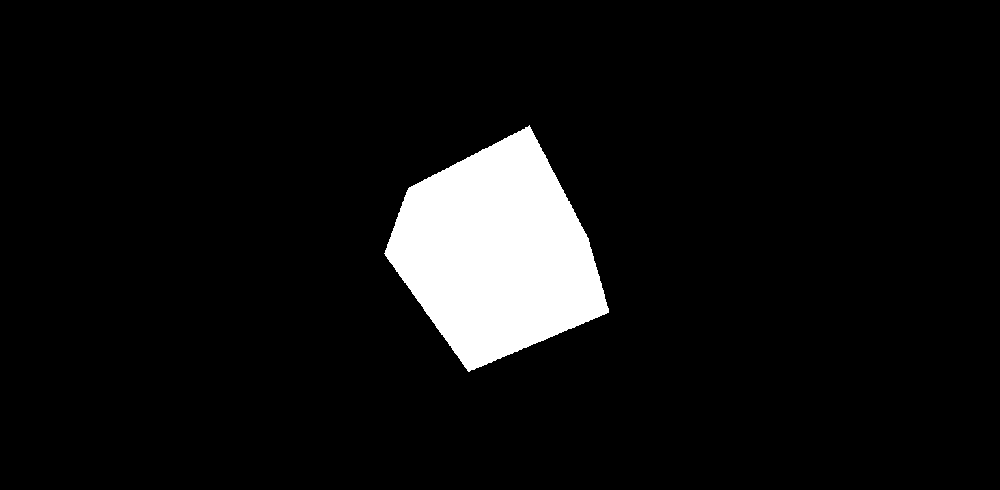

複数置いても見え方は均一か？

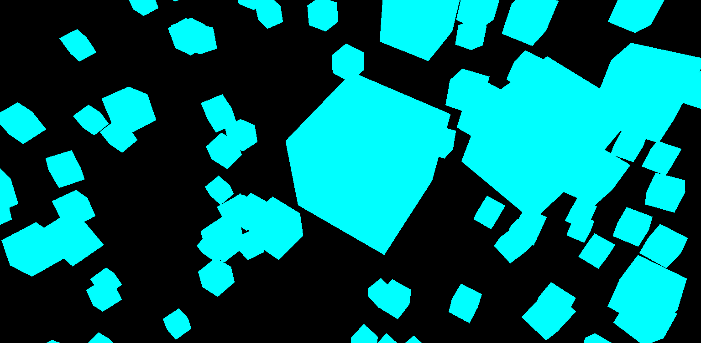

複数置いても色は均一に見える。
BasicMaterialはベタ塗りな感じなのでジオメトリの形がはっきりとはわからない。

## MeshNormalMaterial

法線マテリアル
RGBによる指定になる。
Basic Material同様光源を置かなくても良いマテリアル、動作確認のために使用する。。
```js
new THREE.MeshNormalMaterial();
```

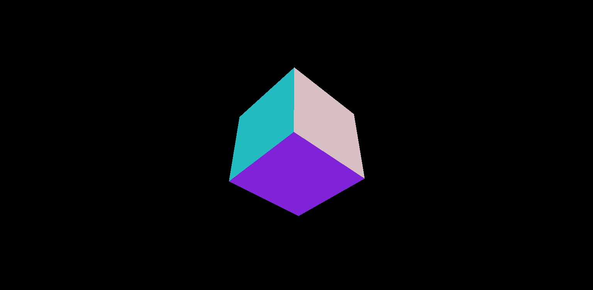

複数置いても見え方は均一か？

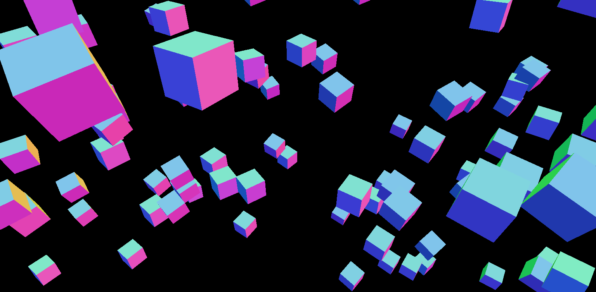

複数置いても色は均一に見える。
BasicMaterialと比べるとNormalMaterialはジオメトリの形がはっきりとわかる。

## MeshLambertMaterial

ランバートマテリアルもしくはランバートシェーディングとも言う。
Specularつまり反射を考慮しないマテリアルになる、反射しないため光沢感はないマットな質感になる。
陰影が必要なため、光源を置く必要がる。

```ts
new THREE.MeshLambertMaterial({ color: 0x00ff00 });
```

そもそも光源が必要なため、光源を置かないとどうなるかと言うと


光源がないと真っ暗で何も見えない。なので光源おいてみると。

配置する光源は、点光源と平行光源です。

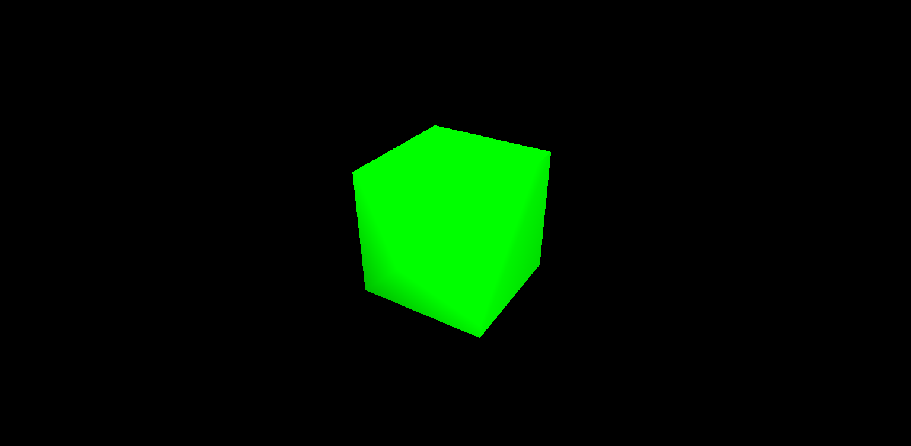

1. 複数置いた場合見え方はどう変わるだろうか？

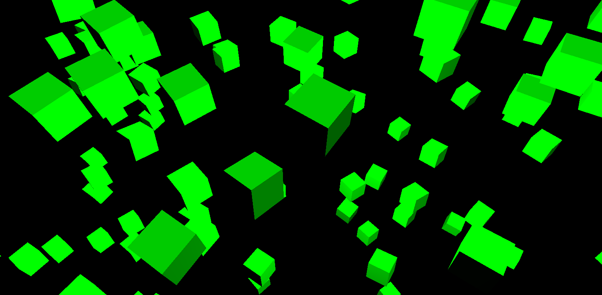

はっきりと見えて、陰影がついているのがわかると思います。

見え方は均一でない、光源の位置やジオメトリの座標や向きに見え方は反映される。

では光源を点光源のみ配置しかつ光源が動いていた場合はどうなるか？

2. 光源が動いていた場合はどうなるか？

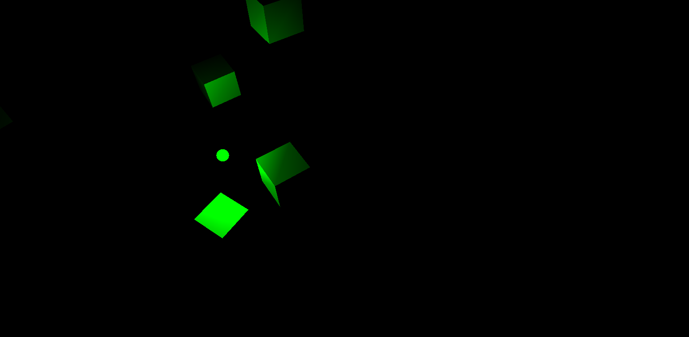

光源の位置によって大きく見方は異なる。

3. 複数の光源が動いていた場合どうなるか？

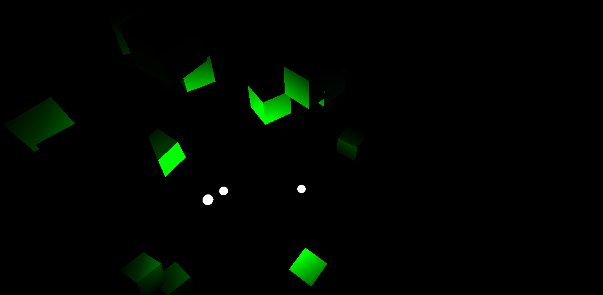

## MeshPhongMaterial

フォンマテリアもしくはフォンシェーディングとも言う。

フォンシェーディングはランバートシェーディングとは違い反射を考慮されているマテリアルになるため光沢感のある質感になります。

ランバートシェーディングと同じで光源が必要になります。

```ts
new THREE.MeshPhongMaterial({ color: 0x00ff00 });
```

### 1. 点光源を周回させる。

このときの条件は以下です。
1. 平行光源と点光源を設置する。
2. 点光源は周回させる。

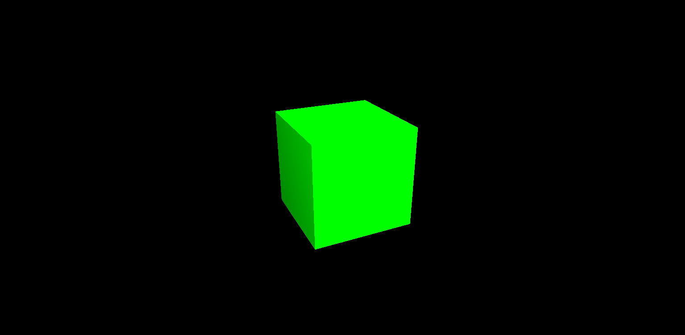

ジオメトリが反射しているのがわかるかと思います。
ただこれだけだでは正直わかりにくいと思います。

### 2. 複数のジオメトリを配置しつつ複数の点光源を周回させる。

このときの条件は以下です
1. このとき平行光源の設置は行わない。
2. 点光源は3つまで配置。
3. 点光源は別々の方向に周回させる。

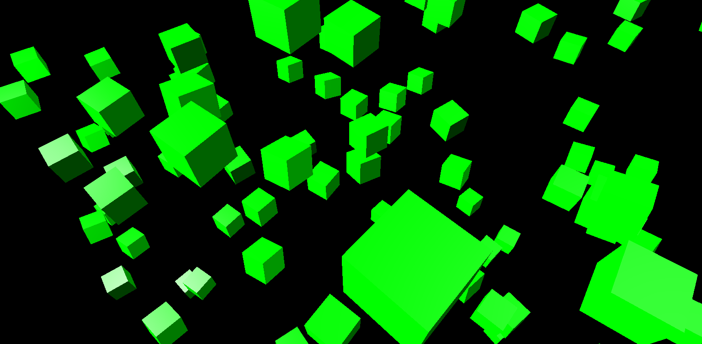

はっきりと反射しているのが左下の方にあると思います。

### 3. ランダムマテリアル

複数のマテリアルをかけたジオメトリをランダムに配置する。

使うマテリアルの種類

1. `Mesh Basic Material`
2. `Normal Material`
3. `Lambert Material`
4. `Phong Material`

の4種類

それぞれ30個ずつランダムに配置する。

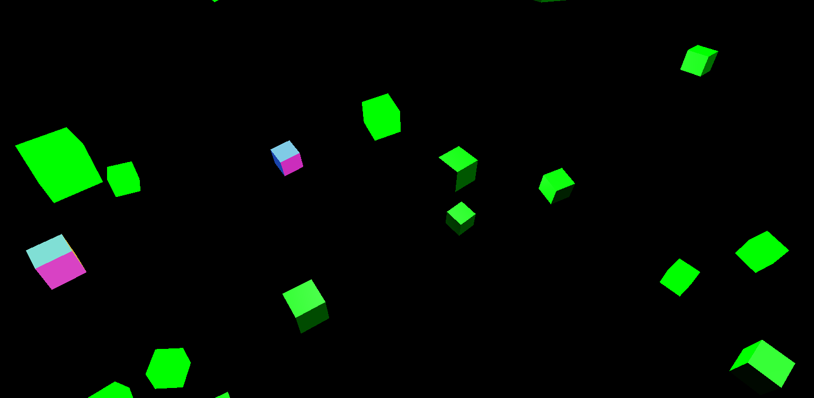

## Mesh Toon Material

トゥーンマテリアルはトゥーンシェーダーともいい、アニメの用な感じが出るマテリアルです。
トゥーンマテリアルはフォンマテリアルの拡張なのでフォンマテリアル同様光源が必要になります。

```ts
new THREE.MeshToonMaterial({ color: 0x444488});
```

暗めの色だとわかりにくいかもしれません。

### 1. 点光源を周回させる。

このときの条件は以下です。
1. 平行光源と点光源を設置する。
2. 点光源は周回させる。
3. 背景色は0xffaa00に設定。
4. マテリアルカラーは0x444488に設定。

点光源を周回させるには以下のようにすれば周期彗星のようにくるくる回せます。
(必ず```requestAnimationFrame(draw)```を呼び出す関数の中に書いてください。)

```ts
POINT_LIGHT.position.set(
  200 * Math.sin(Date.now() / 500),
  200 * Math.sin(Date.now() / 1000),
  200 * Math.cos(Date.now() / 500)
);
```

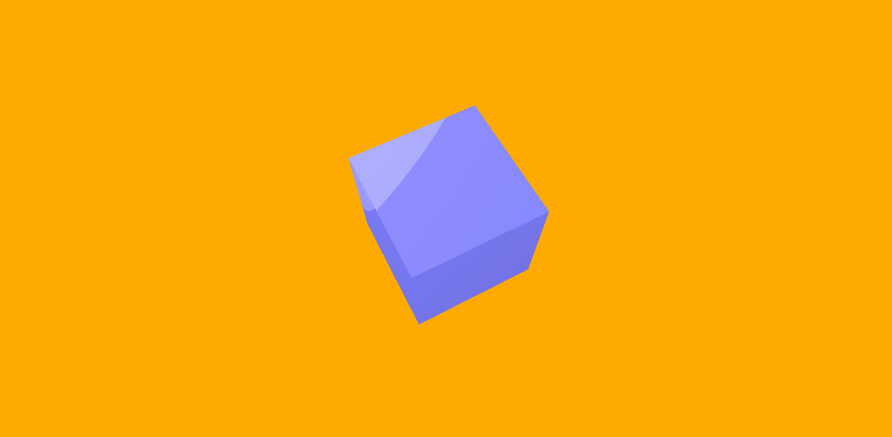

### 2. 複数のジオメトリを配置しつつ点光源を周回させる。

このときの条件は以下です
1. 点光源は1つまで配置。
2. 点光源は別々の方向に周回させる。
3. 平行光源の設置。
4. 複数の色を使う。

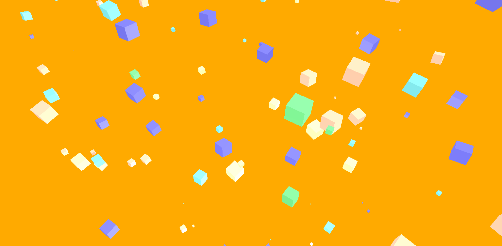

### 3. モニョモニョと動かす

このときの条件は以下です
1. 点光源は1つまで配置。
2. 点光源は別々の方向に周回させる。
3. 平行光源の設置。
4. 複数の色を使う。
5. sinとcosを使う。
6. 画面からはみ出さない（周期彗星のような動きをする光源以外）

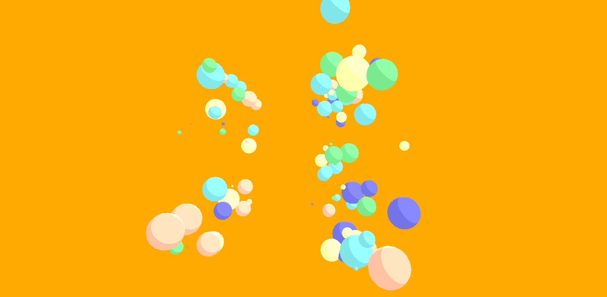

## Mesh Standard Material

物理ベースレンダリングのマテリアルです。UnityやUnrealなどにも実装されています。
3Dアプリケーション開発においては不可欠と言っても良いと思います。
```Mesh Lambert Material```や```Mesh Phong Material```よりも光の反射や散乱などパラメーターも多く設定できるため、リアルな質感が出ると思います。

### 1. どのようなパラメーターが設定できるか実際に確認してみる。

```ts
new THREE.MeshStandardMaterial({
    color: 0x66ff99,
    roughness: 0.5,
    metalness: 1.0,});
```

```color```は色の設定です。
```roughness```は光沢感の設定です。設定値としては0.0から1.0の間で値が高いほど光沢感が出ます。
```metalness```は金属感の設定です。設定値は2つしかなく0.0が非金属、1.0が金属です。

### 2. Dodecahedronの増殖。

以下は条件です。

1. その名の通りDodecahedronを増殖させる。
2. 色は0x66ff99,0x6699ff,0xff9900の3色のみ。
3. roughnessはすべて0.5を設定。
4. metalnessは1.0を選択。
5. 増殖数は任意。

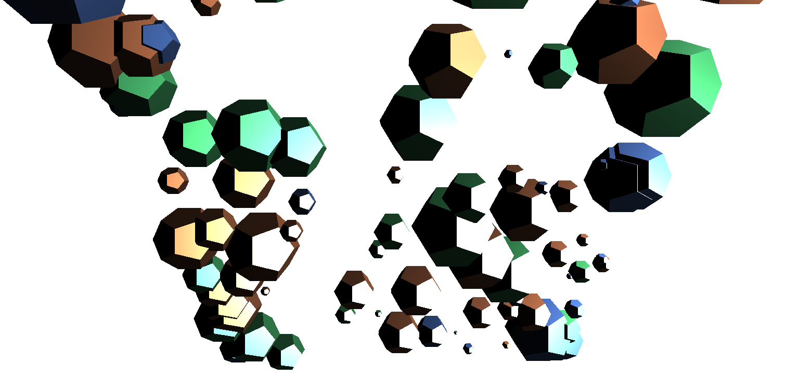

### 3. 自由だよ1

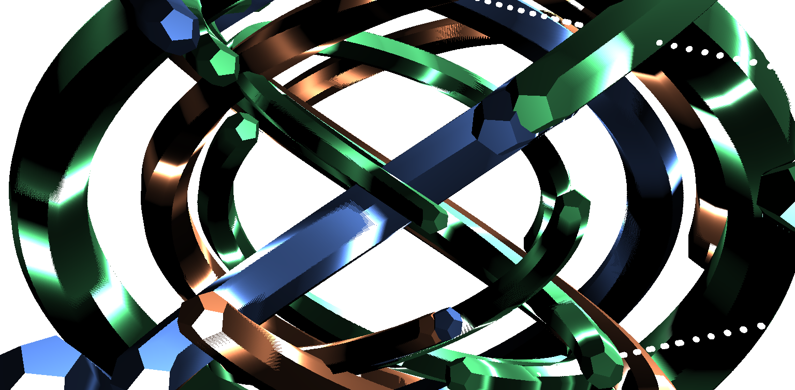